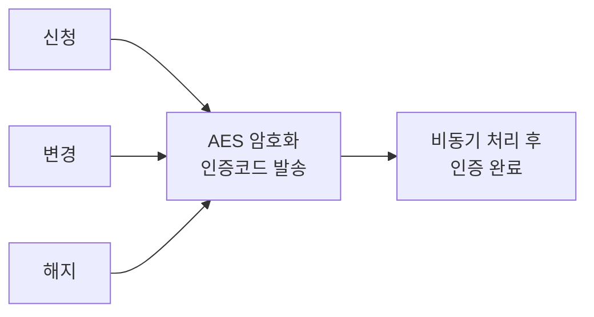

# 국가생명윤리정책원 대표홈페이지 (nibp-portal)

공공기관 대표 홈페이지 백엔드. nibp-edu에서 설계한 공통 모듈을 재활용.

---

## 기술 스택

- **Backend**: Spring Boot 2.7.18, eGovFramework 4.3.0, MyBatis
- **DB**: MariaDB
- **Auth**: Spring Security, JWT, Redis
- **기타**: Thymeleaf, Apache POI, JXLS
- **Infra**: Docker, Jenkins

---

## 프로젝트 개요

| 항목 | 내용 |
|------|------|
| 기간 | 2025.10 ~ 2026.03 (약 5개월) |
| 팀 구성 | 3인 |
| 도메인 | 기관 소개 / 정보 제공 / 민원 / 메일링 |

---

## 참고 사항

- 이 저장소는 포트폴리오 목적으로 코드 구조와 구현 내용을 공개합니다.
- 실제 운영 환경과 분리되어 있고, DB 스키마/데이터가 포함되어 있지 않아 별도 환경 구성 없이는 직접 실행할 수 없습니다.
- 빌드 환경(참고): Java 11 이상, Gradle, MariaDB, Redis
- DB 접속정보, JWT 시크릿, 메일 발송 계정 등 민감한 설정값은 `application.yml`에서 관리되며, 보안상 저장소에는 포함하지 않았습니다.

---

## 주요 기능

### nibp-edu 공통 모듈 재활용
- 게시판 / 설문 / 엑셀 공통 모듈을 nibp-portal에 그대로 재활용
- 국내/해외 언론동향 카테고리/게재일자/키워드 컬럼 추가

### 메일링 시스템 신규 개발

- 뉴스레터 신청 / 변경 / 해지 3가지 모드
- AES 암호화 인증코드 발송, 비동기 처리, 만료 처리
- 관리자 알림 이메일 자동 발송
- 만료 인증 데이터 스케줄러 정리

### 공공데이터 의견수렴
- 사용자 의견 저장 + 관리자 조회

### N-gram 통합검색
- 게시판/공지/QNA처럼 콘텐츠가 여러 테이블에 흩어져 있어 통합검색이 필요했는데, 일반 LIKE 검색은 인덱스를 타지 못해 테이블이 늘어날수록 느려지고 한글 특성상 기본 풀텍스트 인덱스로는 부분 검색 매칭이 잘 안 되는 문제가 있어, 텍스트를 N글자 단위로 잘라 인덱싱하는 N-gram 방식을 적용해 부분 검색에도 인덱스를 활용할 수 있도록 구현

---

## 트러블슈팅

### 메일링 인증 코드 발송 실패
> 인증코드 메일 발송 시, MessagingException 발생이 트랜잭션 롤백으로 이어지는 문제 → 비동기(sendEmailWithTemplateAsync) 발송으로 분리해 메일 실패가 트랜잭션에 영향 주지 않도록 개선

- **문제**: MessagingException 발생 시 트랜잭션 롤백 문제
- **해결**: 비동기(sendEmailWithTemplateAsync) 발송으로 분리

### 동적 게시판 QNA 타입 비밀번호 암호화 불일치
> 동적 게시판을 QNA 타입으로 설정했을 때, 쿼리단에 암호화가 적용되지 않아 비밀번호 비교가 실패하는 문제 → BoardMapper.xml에 암호화 쿼리를 적용해 정상 비교되도록 수정 (별도의 고정 QNA 게시판과는 무관한 독립 기능)

- **문제**: 쿼리단 암호화 미적용으로 비교 실패
- **해결**: BoardMapper.xml 암호화 쿼리로 변경
